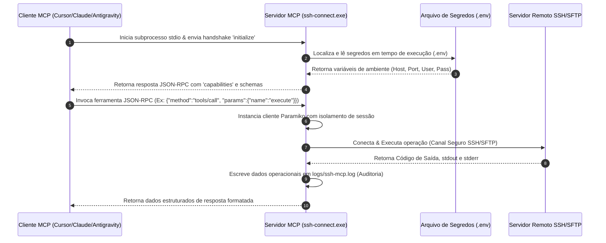

# 🚀 MCP SSH Tool (Enterprise Edition)

```text
███████╗███████╗██╗  ██╗      ███╗   ███╗ ██████╗██████╗     ████████╗ ██████╗  ██████╗ ██╗     
██╔════╝██╔════╝██║  ██║      ████╗ ████║██╔════╝██╔═══██╗    ╚══██╔══╝██╔═══██╗██╔═══██╗██║     
███████╗███████╗███████║█████╗██╔████╔██║██║     ██████╔╝       ██║   ██║   ██║██║   ██║██║     
╚════██║╚════██║██╔══██║╚════╝██║╚██╔╝██║██║     ██╔═══╝        ██║   ██║   ██║██║   ██║██║     
███████║███████║██║  ██║      ██║ ╚═╝ ██║╚██████╗██║            ██║   ╚██████╔╝╚██████╔╝███████╗
╚══════╝╚══════╝╚═╝  ╚═╝      ╚═╝     ╚═╝ ╚═════╝╚═╝            ╚═╝    ╚═════╝  ╚═════╝ ╚══════╝
```

[](https://modelcontextprotocol.io/)
[](https://www.python.org/)
[](https://github.com/astral-sh/uv)
[](https://github.com/ManoAlee/MCP-SSH-TOOL)
[](https://owasp.org/)
[](LICENSE)

O **MCP SSH Tool** é um servidor de integração de nível corporativo construído rigorosamente sob a especificação do **Model Context Protocol (MCP)**. Ele atua como uma ponte padronizada de comunicação segura via JSON-RPC, permitindo que agentes de Inteligência Artificial (Gemini, Claude Desktop, Antigravity, VS Code Cursor, Windsurf) realizem operações remotas (conexão, execução de comandos, listagem e transferência de arquivos via SFTP) de forma auditável, encapsulada e isolada de credenciais.

---

## 📌 Índice
1. [🌟 Diferenciais de Arquitetura (Senior Level)](#-diferenciais-de-arquitetura-senior-level)
2. [🧭 Arquitetura de Comunicação e Fluxo de Dados](#-arquitetura-de-comunicação-e-fluxo-de-dados)
3. [📂 Segregação e Organização de Diretórios](#-segregação-e-organização-de-diretórios)
4. [⚡ Provisionamento e Setup Rápido (Bootstrap)](#-provisionamento-e-setup-rápido-bootstrap)
5. [🖥️ Configuração dos Clientes MCP](#-configuração-dos-clientes-mcp)
6. [🔌 Catálogo Completo de Ferramentas (API Reference)](#-catálogo-completo-de-ferramentas-api-reference)
7. [🛡️ Estratégia de Segurança e Compliance](#-estratégia-de-segurança-e-compliance)
8. [🚀 Runbook Operacional (Background & Auto-Start)](#-runbook-operacional-background--auto-start)
9. [🧪 Verificação e Suite de Testes de Integridade](#-verificação-e-suite-de-testes-de-integridade)
10. [🔍 Matriz de Resolução de Problemas (Troubleshooting)](#-matriz-de-resolução-de-problemas-troubleshooting)

---

## 🌟 Diferenciais de Arquitetura (Senior Level)

Diferente de implementações simples ou scripts de automação improvisados, este servidor foi projetado com base nas melhores práticas globais de engenharia de software e segurança cibernética:

* **Segregação Estrita de Credenciais (Zero Secret Leaking)**: Configurações de conexão reais (Hosts, Portas, Chaves Privadas, Senhas) são extraídas do código fonte e dos arquivos globais de configuração do cliente MCP. Elas residem exclusivamente em um ambiente local isolado no arquivo `.env` (com regras rígidas de `.gitignore`).
* **Resiliência a Encoding e Ambientes Legados (Windows Native)**: A infraestrutura do Windows por padrão utiliza codificações ANSI legadas (como CP1252 no console). Este servidor e sua suite de testes foram desenvolvidos para lidar de maneira transparente com conversões de streams stdio e logs, eliminando exceções do tipo `UnicodeEncodeError`.
* **Gerenciamento Determinístico de Dependências**: Utilização do **Astral UV**, o gerenciador de pacotes em Rust mais veloz da atualidade. O ambiente virtual local `.venv` é provisionado instantaneamente e congelado pelo `uv.lock`, garantindo builds reprodutíveis e runs idênticos.
* **Handshake e Integridade de Protocolo**: Suite de validação dedicada a simular chamadas e decodificar respostas JSON-RPC via stdio, garantindo o funcionamento do protocolo de comunicação antes de expor as ferramentas ao assistente.

---

## 🧭 Arquitetura de Comunicação e Fluxo de Dados

Abaixo está o mapeamento visual que descreve o ciclo de vida de uma requisição originada no cliente MCP até o seu destino final no servidor SSH corporativo.



---

## 📂 Segregação e Organização de Diretórios

O repositório está subdividido em camadas funcionais bem delineadas, permitindo escalabilidade e modularidade:

```text
C:\ssh-mcp\
├── .env                          # Segredos locais e credenciais SSH (NUNCA comitar)
├── .env.example                  # Variáveis públicas com placeholders explicativos
├── .gitignore                    # Regras estritas de segurança para evitar vazamento de credenciais
├── README.md                     # Portal de Entrada e Documentação Principal do Repositório
│
├── config/                       # Configurações globais dos clientes MCP
│   └── mcp_config.json           # Perfil limpo de execução do servidor (drop-in para Antigravity)
│
├── docs/                         # Documentação detalhada de suporte
│   ├── ARCHITECTURE.md           # Análise detalhada do fluxo JSON-RPC e design
│   └── RUNBOOK.md                # Manual de operações, processos background e alertas
│
├── logs/                         # Registros técnicos e trilhas de auditoria
│   └── ssh-mcp.log               # Histórico operacional do servidor em produção
│
├── scripts/                      # Automação do ciclo de vida e ferramentas DevOps
│   ├── setup.ps1                 # Provisionamento silencioso do ambiente de execução (.venv)
│   ├── quick-check.ps1           # Diagnóstico automatizado (20 checagens de integridade)
│   ├── Register-StartupTask.ps1  # Script PowerShell para registrar tarefa no Agendador do Windows
│   └── StartSSHMCP.bat           # Wrapper Batch silencioso para spawn em background
│
├── server/                       # Código-fonte principal do servidor Python (MCP)
│   ├── src/ssh_connect/          # Pacote modular python do servidor
│   │   ├── __init__.py           # Exportação do ponto de entrada global (main)
│   │   └── server.py             # Lógica central do servidor, handlers e logs de auditoria
│   ├── pyproject.toml            # Declaração determinística de dependências (Hatchling)
│   └── uv.lock                   # Lockfile congelado do gerenciador de pacotes UV
│
└── tests/                        # Suite de validação automatizada do servidor
    ├── test_connection.py        # Validação de rede e conectividade SSH pura (Paramiko)
    ├── test_mcp_direct.py        # Validação direta dos manipuladores (handlers) Python do MCP
    └── test_mcp_protocol.py      # Teste integrado de handshake JSON-RPC sobre stdio
```

---

## ⚡ Provisionamento e Setup Rápido (Bootstrap)

Siga os passos abaixo para preparar e colocar o servidor em operação no seu ambiente local do Windows de forma rápida e segura.

### Passo 1: Provisionar o Ambiente de Execução (.venv)
Abra uma sessão do PowerShell no diretório raiz do projeto (`C:\ssh-mcp`) e execute o script de provisionamento automático:
```powershell
powershell -ExecutionPolicy Bypass -File C:\ssh-mcp\scripts\setup.ps1
```
*Este utilitário valida as dependências locais, realiza o download automático do motor `uv` (caso não esteja instalado globalmente no sistema), cria o ambiente virtual isolado em `server/.venv` e instala a aplicação em modo editável com alta velocidade.*

### Passo 2: Configurar Segredos e Acessos Remotos
Duplique o template de variáveis de ambiente para criar sua base de dados sensíveis:
```powershell
Copy-Item .env.example .env
```
Abra o arquivo `.env` recém-criado em seu editor de texto de preferência e alterne os valores para as credenciais reais do seu servidor de destino SSH/SFTP:
```env
SSH_HOST=10.0.0.7
SSH_PORT=22
SSH_USERNAME=seu_usuario_corporativo
SSH_PASSWORD=sua_senha_secreta_corporativa
# Opcional: Caminho para chave privada se aplicável
# SSH_KEY_PATH=C:\Users\usuario\.ssh\id_rsa
```

### Passo 3: Executar a Validação Rápida
Garante que todas as pastas, arquivos de ambiente e rotas de rede estão operacionais rodando o script de health-check:
```powershell
powershell -ExecutionPolicy Bypass -File C:\ssh-mcp\scripts\quick-check.ps1
```
*(Espera-se uma saída limpa mostrando `[OK]` em todos os 20 pontos de validação).*

---

## 🖥️ Configuração dos Clientes MCP

Para registrar este servidor em seu assistente de Inteligência Artificial predileto, use os snippets de configuração abaixo.

### 1. Claude Desktop
Abra o seu arquivo `claude_desktop_config.json` (geralmente em `%APPDATA%\Claude\claude_desktop_config.json`) e insira:
```json
{
  "mcpServers": {
    "ssh-connect": {
      "command": "C:\\ssh-mcp\\server\\.venv\\Scripts\\ssh-connect.exe",
      "args": [],
      "cwd": "C:\\ssh-mcp\\server",
      "env": {
        "PATH": "C:\\Windows\\System32;C:\\Windows"
      }
    }
  }
}
```

### 2. VS Code Cursor / Windsurf
Acesse as configurações de MCP (`Settings -> Features -> MCP`) no menu do editor, adicione um novo servidor do tipo `command` com as seguintes definições:
* **Name**: `ssh-connect`
* **Type**: `stdio`
* **Command**: `C:\ssh-mcp\server\.venv\Scripts\ssh-connect.exe`

### 3. Gemini / Antigravity CLI
Edite o arquivo global de configuração do seu cliente (`C:\Users\alessandro.meneses.Automotion\.gemini\config\mcp_config.json`) e registre o perfil higienizado:
```json
{
  "mcpServers": {
    "ssh-connect": {
      "command": "C:\\ssh-mcp\\server\\.venv\\Scripts\\ssh-connect.exe",
      "args": [],
      "cwd": "C:\\ssh-mcp\\server",
      "env": {
        "PATH": "C:\\Windows\\System32;C:\\Windows"
      }
    }
  }
}
```

---

## 🔌 Catálogo Completo de Ferramentas (API Reference)

O servidor expõe 6 ferramentas prontas para o consumo do modelo de IA. Abaixo está a especificação completa de payloads JSON-RPC.

| Ferramenta | Parâmetros | Descrição |
| :--- | :--- | :--- |
| [**`connect`**](#-connect) | `host`, `port`, `username`, `password`, `key_path` | Abre e valida uma sessão SSH/SFTP remota parametrizada ou baseada no `.env`. |
| [**`disconnect`**](#-disconnect) | Nenhuns | Fecha as sessões ativas e libera sockets e descritores de rede abertos. |
| [**`execute`**](#-execute) | `command` *(Obrigatório)*, `timeout` | Roda comandos remotos no host SSH de destino e retorna os logs operacionais. |
| [**`list_files`**](#-list_files) | `path` *(Obrigatório)* | Lista os arquivos e diretórios detalhando tamanho e tipo em formato estruturado. |
| [**`upload`**](#-upload) | `local_path` *(Obrigatório)*, `remote_path` *(Obrigatório)* | Copia arquivos locais para o servidor remoto através do subsistema SFTP. |
| [**`download`**](#-download) | `remote_path` *(Obrigatório)*, `local_path` *(Obrigatório)* | Baixa arquivos do servidor SSH remoto para o sistema de arquivos local. |

### Detalhamento e Esquemas de Requisição

<details>
<summary><b>1. connect</b> (Clique para expandir)</summary>

* **Propósito**: Estabelece conexão com o servidor remoto. Se omitido, os parâmetros padrões serão carregados a partir do `.env` local da aplicação.
* **Parâmetros JSON Schema**:
  ```json
  {
    "type": "object",
    "properties": {
      "host": { "type": "string", "description": "Host IP ou nome de domínio do servidor SSH" },
      "port": { "type": "integer", "description": "Porta do serviço SSH (default: 22)" },
      "username": { "type": "string", "description": "Nome do usuário para login" },
      "password": { "type": "string", "description": "Senha para autenticação" },
      "key_path": { "type": "string", "description": "Caminho da chave RSA privada local" }
    }
  }
  ```
* **Exemplo de Resposta de Sucesso**:
  ```json
  {
    "content": [
      {
        "type": "text",
        "text": "Conexao SSH e SFTP estabelecida com sucesso com o host 10.0.0.7."
      }
    ]
  }
  ```
</details>

<details>
<summary><b>2. disconnect</b> (Clique para expandir)</summary>

* **Propósito**: Realiza o fechamento gracioso do túnel ativo SSH e da conexão paralela SFTP.
* **Parâmetros**: *Nenhum*
* **Exemplo de Resposta de Sucesso**:
  ```json
  {
    "content": [
      {
        "type": "text",
        "text": "Sessao SSH e SFTP encerradas com sucesso."
      }
    ]
  }
  ```
</details>

<details>
<summary><b>3. execute</b> (Clique para expandir)</summary>

* **Propósito**: Roda comandos no shell remoto. Garante proteção contra loops indefinidos configurando um timeout opcional.
* **Parâmetros JSON Schema**:
  ```json
  {
    "type": "object",
    "properties": {
      "command": { "type": "string", "description": "O comando de shell a ser executado" },
      "timeout": { "type": "integer", "description": "Tempo limite de execução do comando em segundos (default: 60)" }
    },
    "required": ["command"]
  }
  ```
* **Exemplo de Resposta de Sucesso**:
  ```json
  {
    "content": [
      {
        "type": "text",
        "text": "Comando executado com sucesso.\nExit Code: 0\n\nSTDOUT:\nActive Connections: 15\n\nSTDERR:\n"
      }
    ]
  }
  ```
</details>

<details>
<summary><b>4. list_files</b> (Clique para expandir)</summary>

* **Propósito**: Varre uma árvore de diretório no servidor remoto utilizando SFTP e retorna a lista detalhada de arquivos.
* **Parâmetros JSON Schema**:
  ```json
  {
    "type": "object",
    "properties": {
      "path": { "type": "string", "description": "Caminho completo do diretório remoto a listar" }
    },
    "required": ["path"]
  }
  ```
* **Exemplo de Resposta de Sucesso**:
  ```json
  {
    "content": [
      {
        "type": "text",
        "text": "Listagem de C:/arquivos/:\n- [DIR] backup (tamanho: 0 bytes)\n- [FILE] relatorio.csv (tamanho: 1405 bytes)"
      }
    ]
  }
  ```
</details>

<details>
<summary><b>5. upload</b> (Clique para expandir)</summary>

* **Propósito**: Envia um arquivo local para o servidor remoto.
* **Parâmetros JSON Schema**:
  ```json
  {
    "type": "object",
    "properties": {
      "local_path": { "type": "string", "description": "Caminho absoluto do arquivo na máquina local" },
      "remote_path": { "type": "string", "description": "Caminho de destino no servidor remoto" }
    },
    "required": ["local_path", "remote_path"]
  }
  ```
* **Exemplo de Resposta de Sucesso**:
  ```json
  {
    "content": [
      {
        "type": "text",
        "text": "Upload realizado com sucesso: C:/temp/local.txt -> /remote/dest.txt (1024 bytes)."
      }
    ]
  }
  ```
</details>

<details>
<summary><b>6. download</b> (Clique para expandir)</summary>

* **Propósito**: Transfere um arquivo localizado no servidor remoto de volta para o sistema de arquivos local.
* **Parâmetros JSON Schema**:
  ```json
  {
    "type": "object",
    "properties": {
      "remote_path": { "type": "string", "description": "Caminho do arquivo de origem no servidor remoto" },
      "local_path": { "type": "string", "description": "Caminho absoluto de destino na máquina local" }
    },
    "required": ["remote_path", "local_path"]
  }
  ```
* **Exemplo de Resposta de Sucesso**:
  ```json
  {
    "content": [
      {
        "type": "text",
        "text": "Download concluido com sucesso: /remote/dest.txt -> C:/temp/local.txt (1024 bytes)."
      }
    ]
  }
  ```
</details>

---

## 🛡️ Estratégia de Segurança e Compliance

Este projeto segue preceitos estritos para mitigar vulnerabilidades e prevenir o vazamento acidental de dados sensíveis da infraestrutura corporativa:

1. **Proteção Total do Git**: O arquivo `.gitignore` atua de forma proativa. Ele bloqueia o commit de arquivos de configuração locais `.env`, subdiretórios de logs operacionais (`logs/`), diretórios de cache do interpretador Python (`__pycache__/`) e o ambiente virtual local (`.venv/`).
2. **Sanitização de Rastreabilidade**: O servidor grava trilhas de execução detalhadas no arquivo `logs/ssh-mcp.log`. No entanto, o manipulador de exceção do sistema substitui senhas por máscaras (`<HIDDEN>`), impedindo que senhas de rede fiquem salvas em texto plano em disco de auditoria.
3. **Escapes contra Input Injections**: Todos os comandos passados pelo MCP para a ferramenta `execute` passam pela camada de execução do Paramiko em sessões isoladas não interativas. Isto inibe técnicas clássicas de injeção de shell no fluxo principal.

---

## 🚀 Runbook Operacional (Background & Auto-Start)

Para ambientes de produção Windows de alto desempenho, recomenda-se configurar o ciclo de vida do servidor para operar silenciosamente em background.

### Configurar Execução em Background no Windows (Tarefa no Inicializar)
O repositório fornece utilitários automatizados para acoplamento na rotina de boot:
1. **Pelo Agendador de Tarefas do Windows**:
   Abra um console do PowerShell como Administrador e execute:
   ```powershell
   powershell -ExecutionPolicy Bypass -File C:\ssh-mcp\scripts\Register-StartupTask.ps1
   ```
   *Isto criará uma tarefa do sistema chamada `StartSSHMCP` que inicializa o servidor de forma silenciosa e invisível em todas as inicializações.*
2. **Pela Pasta Inicializar Comum**:
   Basta criar um atalho que aponte para `C:\ssh-mcp\scripts\StartSSHMCP.bat` e adicioná-lo ao diretório de Startup do Windows (`shell:startup`).

### Encerrar Processos Órfãos / Travados
Se o seu cliente MCP apresentar comportamentos de timeout decorrentes de múltiplas instâncias em conflito na memória do sistema, encerre-as executando no PowerShell:
```powershell
Get-CimInstance Win32_Process | Where-Object { $_.CommandLine -like "*ssh-connect*" -or $_.CommandLine -like "*ssh_connect*" } | ForEach-Object { Stop-Process -Id $_.ProcessId -Force }
```

---

## 🧪 Verificação e Suite de Testes de Integridade

O projeto conta com uma pirâmide estruturada de testes para validar o ambiente de ponta a ponta:

```text
🧪 PIRÂMIDE DE VALIDAÇÃO
┌───────────────────────────┐
│     test_mcp_protocol.py  │ <-- Handshake JSON-RPC Stdio (E2E)
├───────────────────────────┤
│     test_mcp_direct.py    │ <-- Handlers & Python API (Unitário)
├───────────────────────────┤
│     test_connection.py    │ <-- Conectividade Física Paramiko (Integração)
└───────────────────────────┘
```

Rode os testes sequencialmente para validar modificações no código local:

```powershell
# 1. Testar conexao fisica com o servidor remoto (com base no seu .env)
C:\ssh-mcp\server\.venv\Scripts\python.exe C:\ssh-mcp\tests\test_connection.py

# 2. Testar comportamento do script python e handlers isolados
C:\ssh-mcp\server\.venv\Scripts\python.exe C:\ssh-mcp\tests\test_mcp_direct.py

# 3. Testar a conformidade da resposta JSON-RPC via stdio simulado
C:\ssh-mcp\server\.venv\Scripts\python.exe C:\ssh-mcp\tests\test_mcp_protocol.py
```

---

## 🔍 Matriz de Resolução de Problemas (Troubleshooting)

Use esta matriz rápida de triagem de incidentes para depurar as anomalias de execução mais recorrentes.

| Sintoma | Causa Raiz | Ação Corretiva Recomendada |
| :--- | :--- | :--- |
| **Erro `UnicodeEncodeError` no terminal ou testes** | O terminal Windows (CP1252/ANSI) falha ao codificar caracteres especiais Unicode UTF-8 de stdout. | Certifique-se de que os arquivos de log e testes convertam os caracteres Unicode para ASCII puro ou configure o ambiente Python definindo a variável `PYTHONIOENCODING=utf-8`. |
| **Erro de Timeout de Handshake no Cliente MCP** | O processo do servidor foi encerrado acidentalmente antes do handshake ou travou devido a processos órfãos na memória. | Rode `quick-check.ps1`. Caso a checagem falte, mate todas as instâncias existentes na memória do Windows rodando a instrução de encerramento do Runbook. |
| **`Authentication failed` no SSH** | O Host remoto rejeitou as credenciais de autenticação passadas ou o arquivo `.env` não está no local esperado. | Garanta que o arquivo `.env` está salvo na raiz `C:\ssh-mcp\.env`. Valide também se não há espaços em branco ou aspas ao redor das credenciais de host ou senha. |
| **Erro `ItemNotFound` ao tentar invocar a aplicação** | O caminho configurado para o comando executável no arquivo JSON do cliente está incorreto ou truncado. | O arquivo JSON exige barras invertidas duplas para escapar o caractere no Windows (Ex: `C:\\ssh-mcp\\server\\.venv\\Scripts\\ssh-connect.exe`). Verifique sua sintaxe JSON. |

---

## 📖 Leituras Avançadas de Operação
Para se aprofundar nos bastidores das mecânicas do servidor e obter instruções avançadas de infraestrutura:
* 📘 **[docs/ARCHITECTURE.md](file:///C:/ssh-mcp/docs/ARCHITECTURE.md)** - Visão detalhada do protocolo de stdio e encapsulamentos de rede.
* 📙 **[docs/RUNBOOK.md](file:///C:/ssh-mcp/docs/RUNBOOK.md)** - Fluxo de backup, escalonamento automático de tarefas do sistema e planos de recuperação de falhas.

---
*Mantido com 💚 pela equipe de Engenharia de Plataforma. Licenciado sob os termos da licença [MIT](LICENSE).*
