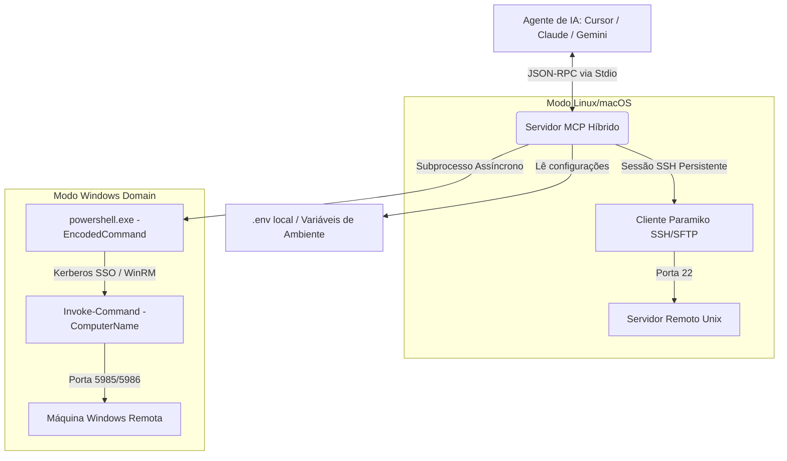
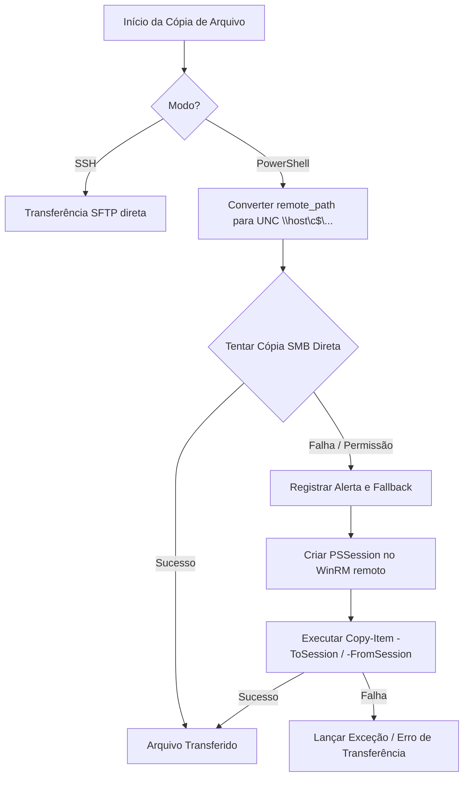
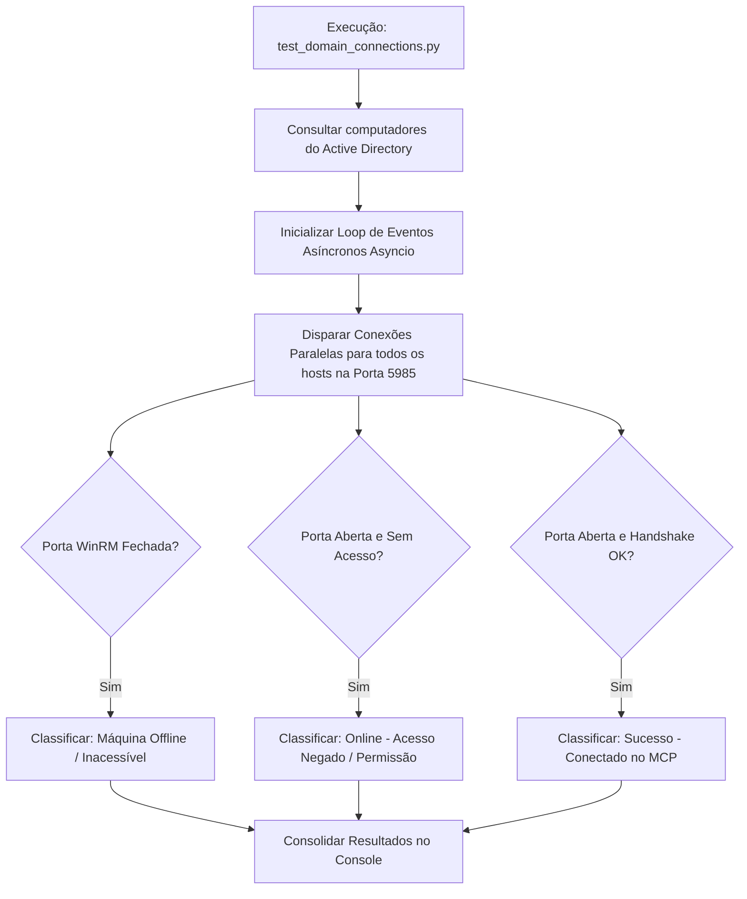

# 🚀 MCP Híbrido: SSH & Windows Domain PowerShell Tool
### *Enterprise-Grade Integration Server for AI-Driven System Administration*

```text
███████╗███████╗██╗  ██╗      ███╗   ███╗ ██████╗██████╗     ████████╗ ██████╗  ██████╗ ██╗     
██╔════╝██╔════╝██║  ██║      ████╗ ████║██╔════╝██╔═══██╗    ╚══██╔══╝██╔═══██╗██╔═══██╗██║     
███████╗███████╗███████║█████╗██╔████╔██║██║     ██████╔╝       ██║   ██║   ██║██║   ██║██║     
╚════██║╚════██║██╔══██║╚════╝██║╚██╔╝██║██║     ██╔═══╝        ██║   ██║   ██║██║   ██║██║     
███████║███████║██║  ██║      ██║ ╚═╝ ██║╚██████╗██║            ██║   ╚██████╔╝╚██████╔╝███████╗
╚══════╝╚══════╝╚═╝  ╚═╝      ╚═╝     ╚═╝ ╚═════╝╚═╝            ╚═╝    ╚═════╝  ╚═════╝ ╚══════╝
```

---

[](https://modelcontextprotocol.io/)
[](https://microsoft.com/powershell)
[](https://www.python.org/)
[](https://github.com/astral-sh/uv)
[](https://owasp.org/)
[](https://github.com/ManoAlee/MCP-SSH-TOOL)

O **MCP Híbrido: SSH & PowerShell Tool** é uma ponte de integração corporativa de alto desempenho construída sob a especificação oficial do **Model Context Protocol (MCP)**. Ele atua como um tradutor inteligente e seguro, permitindo que agentes de Inteligência Artificial (como Cursor, Claude Desktop, Windsurf e Gemini) orquestrem, auditem e administrem infraestruturas híbridas complexas com nível máximo de privilégio e conformidade de segurança.

O servidor gerencia dinamicamente dois motores principais de controle:
1. **Engine Unix/Linux/macOS**: Conexões SSH seguras e operações de arquivos sobre SFTP encapsuladas.
2. **Engine Windows Active Directory**: Sessões remotas WinRM/PowerShell sem transmissão de credenciais em texto plano (via Kerberos SSO do domínio).

---

## 💡 Recursos de Engenharia (Core Features)

> [!NOTE]
> Projetado especificamente para infraestruturas do Active Directory (ex: **corp.local**), permitindo gerenciamento dinâmico sem configuração repetitiva.

* **🔐 Autenticação por Domínio Transparente (Kerberos SSO)**:
  Em ambientes baseados em Windows Server Active Directory, o servidor MCP herda o token de acesso local do operador. Comandos remotos via `Invoke-Command` utilizam Single Sign-On (SSO) implícito.
* **⚡ Invocação Assíncrona Ultrassegura (`powershell_invoke`)**:
  Previne por completo qualquer vulnerabilidade de Shell Injection. Comandos enviados às máquinas Windows são processados assincronamente pelo Python, codificados para `UTF-16LE`, convertidos em Base64 e despachados como `-EncodedCommand`.
* **📂 Transferência Bidirecional de Arquivos Híbrida**:
  - **Linux/Unix**: Envio e recebimento direto usando SFTP persistente.
  - **Windows**: Cópia de alta velocidade nativa através de compartilhamentos administrativos (ex: `\\host\c$`, `\\host\d$`) integrada com o SSO do domínio, com fallback automático para sessão remota WinRM PSSession (`Copy-Item`).
* **🔎 Auditor de Conectividade do Domínio em Larga Escala (`test_domain_connections.py`)**:
  Inclui uma ferramenta de diagnóstico de alto desempenho capaz de varrer em paralelo todas as máquinas cadastradas no AD (mais de 45 computadores) em menos de 10 segundos, identificando o status da porta WinRM e a integridade de permissão de acesso.
* **🎯 Retorno de Dados Estruturados**:
  A listagem de diretórios (`list_files`) no modo Windows executa consultas estruturadas via PowerShell e devolve dados serializados em JSON (`ConvertTo-Json -Compress`), eliminando Regex frágeis sobre saídas tabulares de texto.

---

## 🧭 Arquitetura de Fluxo de Dados e Segurança


```mermaid
flowchart TD
    A[Agente de IA: Cursor / Claude / Gemini] <-->|JSON-RPC via Stdio| B(Servidor MCP Híbrido)
    B -->|Lê configurações| C[.env local / Variáveis de Ambiente]
    
    subgraph Modo Linux/macOS
        B -->|Sessão SSH Persistente| D[Cliente Paramiko SSH/SFTP]
        D -->|Porta 22| E[Servidor Remoto Unix]
    end
    
    subgraph Modo Windows Domain
        B -->|Subprocesso Assíncrono| F[powershell.exe -EncodedCommand]
        F -->|Kerberos SSO / WinRM| G[Invoke-Command -ComputerName]
        G -->|Porta 5985/5986| H[Máquina Windows Remota]
    end
```

### 📂 Fluxo da Engine Híbrida de Transferência de Arquivos (Windows)

```mermaid
flowchart TD
    Start[Início da Cópia de Arquivo] --> ModeCheck{Modo?}
    ModeCheck -- SSH --> SSHCopy[Transferência SFTP direta]
    ModeCheck -- PowerShell --> UNCResolve[Converter remote_path para UNC \\host\c$\...]
    UNCResolve --> UNCCopy{Tentar Cópia SMB Direta}
    UNCCopy -- Sucesso --> Success[Arquivo Transferido]
    UNCCopy -- Falha / Permissão --> LogFallback[Registrar Alerta e Fallback]
    LogFallback --> WinRMSession[Criar PSSession no WinRM remoto]
    WinRMSession --> WinRMCopy[Executar Copy-Item -ToSession / -FromSession]
    WinRMCopy -- Sucesso --> Success
    WinRMCopy -- Falha --> Error[Lançar Exceção / Erro de Transferência]
```

### 🔎 Fluxo de Auditoria e Diagnóstico em Lote do Active Directory

```mermaid
flowchart TD
    A[Execução: test_domain_connections.py] --> B[Consultar computadores do Active Directory]
    B --> C[Inicializar Loop de Eventos Asíncronos Asyncio]
    C --> D[Disparar Conexões Paralelas para todos os hosts na Porta 5985]
    
    D --> E1{Porta WinRM Fechada?}
    E1 -- Sim --> F1[Classificar: Máquina Offline / Inacessível]
    
    D --> E2{Porta Aberta e Sem Acesso?}
    E2 -- Sim --> F2[Classificar: Online - Acesso Negado / Permissão]
    
    D --> E3{Porta Aberta e Handshake OK?}
    E3 -- Sim --> F3[Classificar: Sucesso - Conectado no MCP]
    
    F1 & F2 & F3 --> G[Consolidar Resultados no Console]
```

---

## 🔌 API Reference: Catálogo de Ferramentas MCP

O servidor expõe **10 ferramentas especializadas** integradas que são consumidas dinamicamente pela IA:

### 1. `connect`
Inicializa e valida a sessão ativa no host de destino.
* **Parâmetros**:
  - `host` (string, opcional): IP ou Hostname da máquina (se omitido, usa o valor padrão do `.env`). Pode ser `localhost`, `127.0.0.1` ou `.` para operar na máquina local.
  - `mode` (string, opcional): `"ssh"` ou `"powershell"`.
  - `username` / `password` (string, opcional): Credenciais de acesso explícitas (necessárias para conexões SSH ou servidores fora de domínio).

### 2. `disconnect`
Encerra graciosamente a sessão ativa de rede e limpa os buffers de memória.

### 3. `execute`
Executa comandos arbitrários na sessão ativa conectada.
* **Parâmetros**:
  - `command` (string, obrigatório): Comando Shell ou PowerShell.
  - `timeout` (integer, opcional): Tempo limite de execução (padrão: 60s).

### 4. `list_files`
Exibe os arquivos e subpastas de um determinado diretório (remoto ou local) estruturado com tipo e tamanho.
* **Parâmetros**:
  - `path` (string, obrigatório): Caminho remoto absoluto.

### 5. `upload`
Envia um arquivo do host local para o host remoto. Tenta cópia direta via UNC share (`C$`, `D$`) com fallback automático para `Copy-Item -ToSession` do WinRM se necessário.
* **Parâmetros**:
  - `local_path` (string, obrigatório): Arquivo de origem local.
  - `remote_path` (string, obrigatório): Caminho de destino remoto.

### 6. `download`
Baixa um arquivo do host remoto para o host local. Tenta cópia direta via UNC share (`C$`, `D$`) com fallback automático para `Copy-Item -FromSession` do WinRM se necessário.
* **Parâmetros**:
  - `remote_path` (string, obrigatório): Arquivo de origem remoto.
  - `local_path` (string, obrigatório): Caminho de destino local.

### 7. `powershell_invoke`
Executa scripts PowerShell diretamente, permitindo especificar um computador alvo para remoting instantâneo.
* **Parâmetros**:
  - `command` (string, obrigatório): Scriptblock a ser executado.
  - `computer_name` (string, opcional): Nome do computador de destino na rede Active Directory. Se for local, executa localmente sem `Invoke-Command`.

### 8. `get_system_info`
Diagnóstica de infraestrutura: Gathers CPU model, load percentage, OS version, architecture, logical disk usage, and network adapter details from the active host, returning structured telemetry data.

### 9. `manage_service`
Orquestração de serviços de sistema (status, start, stop, restart, enable, disable) de forma híbrida (Windows Service / systemd Linux).
* **Parâmetros**:
  - `service_name` (string, obrigatório): Nome do serviço (ex: `sshd`, `wuauserv`).
  - `action` (string, obrigatório): `"status"`, `"start"`, `"stop"`, `"restart"`, `"enable"`, `"disable"`.

### 10. `read_event_logs`
Auditoria de logs e eventos de sistema para depuração rápida (Windows EventLog / Linux journalctl & syslog).
* **Parâmetros**:
  - `log_name` (string, opcional): Canal de logs (padrão: `"System"`).
  - `level` (string, opcional): Filtro de erro (`"Error"`, `"Warning"`, `"Information"`, `"All"`).
  - `count` (integer, opcional): Quantidade de logs (padrão: 10).

---

## ⚡ Setup Rápido (Bootstrap no Windows)

### Passo 1: Preparar o Ambiente Virtual (.venv)
Abra o PowerShell local como Administrador, navegue até a raiz do projeto e execute o script de provisionamento automático:
```powershell
powershell -ExecutionPolicy Bypass -File C:\ssh-mcp\scripts\setup.ps1
```
*Este utilitário instala o gerenciador de pacotes ultrarrápido `uv`, configura o ambiente Python `.venv` e resolve todas as dependências em segundos.*

### Passo 2: Configurar o arquivo `.env`
Duplique o template de variáveis de ambiente:
```powershell
Copy-Item .env.example .env
```
Configure as variáveis padrão no arquivo `.env`:
```env
CONNECTION_MODE=powershell
SSH_HOST=srv-win-01
# Dica: Deixe SSH_USERNAME e SSH_PASSWORD vazios para usar o Kerberos SSO do domínio!
```

### Passo 3: Executar Teste de Integridade Operacional
Verifique se a comunicação está ocorrendo conforme o esperado:
```powershell
powershell -ExecutionPolicy Bypass -File C:\ssh-mcp\scripts\quick-check.ps1
```

---

## 🖥️ Integração com Ambientes de Desenvolvimento e IA

### Cursor & Windsurf
Adicione o servidor como uma ferramenta **Stdio MCP** nas configurações de desenvolvimento do editor:
* **Nome**: `ssh-connect`
* **Tipo**: `command`
* **Comando**: `C:\ssh-mcp\server\.venv\Scripts\python.exe`
* **Argumentos**: `C:\ssh-mcp\server\src\ssh_connect\server.py`

### Claude Desktop

Para integrar o servidor MCP no Claude Desktop, edite o arquivo de configuração localizado em `%APPDATA%\Claude\claude_desktop_config.json`. 

Você pode definir as variáveis de conexão diretamente no objeto `"env"` (eliminando a necessidade de arquivo `.env` para o Claude Desktop):

```json
{
  "mcpServers": {
    "ssh-powershell-mcp": {
      "type": "stdio",
      "command": "C:\\ssh-mcp\\server\\.venv\\Scripts\\python.exe",
      "args": [
        "C:\\ssh-mcp\\server\\src\\ssh_connect\\server.py"
      ],
      "cwd": "C:\\ssh-mcp\\server",
      "env": {
        "SSH_HOST": "localhost",
        "CONNECTION_MODE": "powershell",
        "SSH_PORT": "22",
        "SSH_USERNAME": "",
        "SSH_PASSWORD": "",
        "PYTHONUNBUFFERED": "1"
      }
    }
  }
}
```
> [!TIP]
> Deixe os campos `SSH_USERNAME` e `SSH_PASSWORD` vazios para que o Claude Desktop utilize o **Kerberos SSO** do usuário logado na máquina de forma automática.

---

## 📊 Auditoria de Rede e Diagnóstico do Domínio

Para auditar a conectividade e disponibilidade do WinRM / PowerShell Remoting em todas as máquinas da rede local (ex: `corp.local`), você pode executar o script de diagnóstico de alta velocidade:

```powershell
# Executar a varredura paralela assíncrona
C:\ssh-mcp\server\.venv\Scripts\python.exe C:\ssh-mcp\tests\test_domain_connections.py
```

### Exemplo de Retorno do Diagnóstico:

```text
Obtendo lista de computadores do Active Directory...
Total de computadores encontrados no AD: 45
Iniciando varredura paralela de conectividade WinRM (Porta 5985)...

### Relatório de Conectividade do Domínio (MCP / PowerShell Remoting)

| Computador | Porta 5985 (WinRM) | Conexão MCP | Detalhes / Status |
| :--- | :--- | :--- | :--- |
| SRV-APP-01 | Aberta | 🟢 Sucesso | Conectado com sucesso! |
| SRV-WIN-01 | Aberta | 🟢 Sucesso | Conectado com sucesso! |
| WS-USER-01 | Aberta | 🟢 Sucesso | Conectado com sucesso! |
| WS-USER-02 | Aberta | 🟡 Sem Acesso | Falha de Autenticação / Permissão |
| SRV-BACKUP | Fechada | 🔴 Inacessível | Máquina offline ou WinRM desativado |
```

---

## 🛡️ Diretrizes de Segurança Corporativa

1. **Zero Secret Leak (Sem Vazamento de Segredos)**: Nenhuma credencial ou chave privada é persistida no histórico de código. O arquivo `.env` é explicitamente ignorado pelo Git através do `.gitignore`.
2. **Prevenção contra Vulnerabilidades OWASP (A03:2021-Injection)**: A camada Python de interface encapsula comandos remotizados em blocos seguros de execução baseados em bytes Base64, impedindo execução indesejada de caracteres concatenados.
3. **Máscara de Credenciais nos Logs**: O arquivo de log local (`logs/ssh-mcp.log`) remove dados confidenciais e credenciais de conexões mal formatadas para evitar logs expostos.

---

## 🧪 Validação da Suíte de Testes

Antes de submeter alterações ao repositório ou implantar em produção, certifique-se de que todos os testes passaram com sucesso:

```powershell
# 1. Testes de Regressão Básica e Mock PowerShell
C:\ssh-mcp\server\.venv\Scripts\python.exe C:\ssh-mcp\tests\test_powershell.py

# 2. Testes de Protocolo de Comunicação JSON-RPC Stdio
C:\ssh-mcp\server\.venv\Scripts\python.exe C:\ssh-mcp\tests\test_mcp_protocol.py

# 3. Teste de Conexão Ativa Real (Live Validation)
C:\ssh-mcp\server\.venv\Scripts\python.exe C:\ssh-mcp\tests\test_live.py
```

---

## 🔍 Matriz de Resolução de Problemas (Troubleshooting)

| Sintoma / Erro | Causa Provável | Ação Corretiva Recomendada |
| :--- | :--- | :--- |
| **`WinRM cannot complete the operation...`** | O serviço WinRM não está ativo na máquina alvo ou a lista TrustedHosts está restrita. | No host remoto, execute: `Enable-PSRemoting -Force` no PowerShell elevado. |
| **`Access is denied` no Invoke-Command** | O operador local atual não possui direitos de administrador local na máquina remota. | Defina credenciais explícitas (`SSH_USERNAME` e `SSH_PASSWORD`) ou use uma conta que pertença aos grupos "Domain Admins" ou "Remote Management Users". |
| **`I/O operation on closed pipe`** | Política do asyncio no Windows configurada de forma incorreta para execução de subprocessos. | Certifique-se de usar `asyncio.set_event_loop_policy(asyncio.WindowsProactorEventLoopPolicy())` em vez do loop de seleção padrão no Windows. |

---
*Desenvolvido e mantido pela equipe de Engenharia de Infraestrutura e Plataforma.*
