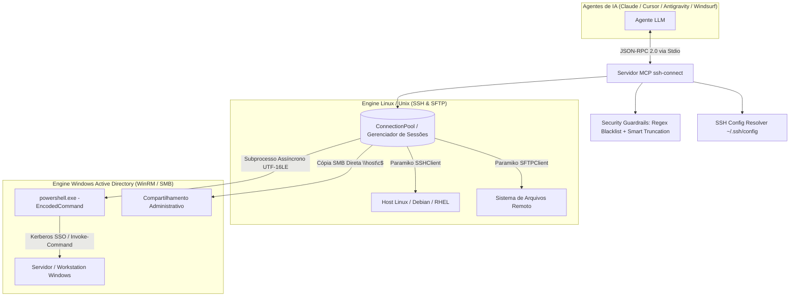

# 🚀 MCP-SSH-TOOL — Hybrid SSH & Windows Domain PowerShell Engine
### *Enterprise-Grade Model Context Protocol Server for AI-Driven Infrastructure & DevOps Orchestration*

<div align="center">

[](LICENSE)
[](https://www.python.org/downloads/)
[](https://modelcontextprotocol.io)
[](https://github.com/ManoAlee/MCP-SSH-TOOL/actions)
[](docs/SECURITY.md)
[](https://github.com/ManoAlee/MCP-SSH-TOOL)

**Servidor corporativo de alta performance construído sobre a especificação oficial do Model Context Protocol (MCP). Permite que agentes de IA autônomos (como Claude Desktop, Cursor, Antigravity, Windsurf e Cline) orquestrem, diagnostiquem e administrem infraestruturas remotas mistas (Linux SSH/SFTP e Windows Active Directory WinRM/PowerShell) com isolamento estrito de privilégios.**

</div>

---

## 🏛️ Pilares de Engenharia & Arquitetura

1. **Pool de Conexões Multissessão (`ConnectionPool`)**:
   - Suporte a múltiplos servidores conectados simultaneamente em segundo plano.
   - Alternância rápida via `alias` ou execução contextualizada por máquina.
   - Rastreamento em tempo real de uptime e integridade da sessão (`transport.is_active()`).
2. **Resolução Dinâmica de SSH Config (`~/.ssh/config`)**:
   - Parse nativo de aliases de host, `HostName`, `User`, `Port`, `IdentityFile` e `ProxyJump`.
   - Suporte transparente a chaves modernas **Ed25519, RSA, ECDSA e DSS** com ou sem passphrase.
3. **Segurança & Blindagem de Contexto LLM**:
   - **Contenção de Tokens (`smart_truncate`)**: Trunca saídas massivas preservando o topo e o final do log/comando, evitando estouro de contexto do agente.
   - **Detecção de Comandos Destrutivos (`is_dangerous_command`)**: Intercepta comandos como `rm -rf /`, `mkfs`, `dd`, fork bombs e `shutdown`, injetando alertas de risco para validação explícita.
   - **Escape PowerShell Sanitizado (`ps_esc`)**: Comandos remotos despachados via `-EncodedCommand` (UTF-16LE + Base64), eliminando qualquer risco de Command Injection.
4. **Transporte Resiliente & Bridge de Compatibilidade MCP**:
   - Compatibilidade unificada com **MCP 1.x & 2.x** (`ListToolsRequest` e `CallToolRequest`).
   - Patch resiliente em `BaseSession._receive_loop` garantindo tratamento de handshakes fora de padrão (ex: `server/discover`), cancelamentos assíncronos e estabilidade contra clientes com desconexões abruptas.

---

## 🧭 Diagrama de Fluxo Arquitetural


```mermaid
flowchart TD
    subgraph Cliente_IA ["Agentes de IA (Claude / Cursor / Antigravity / Windsurf)"]
        Agent[Agente LLM]
    end

    Agent <-->|JSON-RPC 2.0 via Stdio| Server[Servidor MCP ssh-connect]

    Server --> Pool[(ConnectionPool / Gerenciador de Sessões)]
    Server --> Sec[Security Guardrails: Regex Blacklist + Smart Truncation]
    Server --> Resolver[SSH Config Resolver ~/.ssh/config]

    subgraph Linux_Engine ["Engine Linux / Unix (SSH & SFTP)"]
        Pool -->|Paramiko SSHClient| LinuxNode[Host Linux / Debian / RHEL]
        Pool -->|Paramiko SFTPClient| LinuxFS[Sistema de Arquivos Remoto]
    end

    subgraph Windows_Engine ["Engine Windows Active Directory (WinRM / SMB)"]
        Pool -->|Subprocesso Assíncrono UTF-16LE| PSLocal[powershell.exe -EncodedCommand]
        PSLocal -->|Kerberos SSO / Invoke-Command| WinNode[Servidor / Workstation Windows]
        Pool -->|Cópia SMB Direta \\host\c$| WinFS[Compartilhamento Administrativo]
    end
```

---

## 🛠️ Catálogo Completo das 17 Ferramentas MCP

Abaixo está o guia detalhado de cada ferramenta com seus parâmetros, tipos e exemplos reais de payload para o agente.

---

### 1. `connect`
Inicializa uma conexão SSH com um servidor Linux ou cria uma sessão PowerShell/WinRM para uma máquina Windows.
* **Parâmetros**:
  * `host` (*string*, obrigatório/opcional se houver `.env`): IP, FQDN ou alias do `~/.ssh/config` (ex: `"192.168.1.100"`, `"srv-linux-01"`, `"localhost"`).
  * `mode` (*string*, opcional): `"ssh"` (padrão) ou `"powershell"`.
  * `port` (*integer*, opcional): Porta SSH (padrão: `22` ou obtida do `~/.ssh/config`).
  * `username` (*string*, opcional): Usuário de autenticação (se omitido no modo PowerShell, usa o token Kerberos atual).
  * `password` (*string*, opcional): Senha para autenticação por senha.
  * `key_path` (*string*, opcional): Caminho absoluto da chave privada (Ed25519/RSA).
  * `key_passphrase` (*string*, opcional): Senha da chave caso criptografada.
  * `alias` (*string*, opcional): Identificador amigável para alternar no pool (ex: `"producao"`, `"banco-dados"`).

**Exemplo de Chamada:**
```json
{
  "name": "connect",
  "arguments": {
    "host": "192.168.1.100",
    "username": "admin",
    "key_path": "C:\\Users\\admin\\.ssh\\id_ed25519",
    "alias": "srv-prod"
  }
}
```

---

### 2. `disconnect`
Encerra a sessão ativa ou uma sessão específica pelo seu alias, liberando recursos e conexões de rede.
* **Parâmetros**:
  * `alias` (*string*, opcional): Nome da sessão a desconectar. Se omitido, encerra a sessão ativa padrão.

**Exemplo de Chamada:**
```json
{
  "name": "disconnect",
  "arguments": {
    "alias": "srv-prod"
  }
}
```

---

### 3. `list_sessions`
Lista todas as sessões registradas no pool com status (`connected`/`disconnected`), modo, host, usuário e tempo de atividade (uptime).
* **Parâmetros**: Nenhum.

**Exemplo de Chamada:**
```json
{
  "name": "list_sessions",
  "arguments": {}
}
```

---

### 4. `execute`
Executa comandos arbitrários no host ativo com proteção contra estouro de contexto e guardrail de comandos destrutivos.
* **Parâmetros**:
  * `command` (*string*, obrigatório): Comando a executar (ex: `"df -h"`, `"systemctl status nginx"`, `"Get-Process"`).
  * `timeout` (*integer*, opcional): Timeout em segundos (padrão: `60`).
  * `alias` (*string*, opcional): Executar em uma sessão específica em vez da sessão padrão.

**Exemplo de Chamada:**
```json
{
  "name": "execute",
  "arguments": {
    "command": "uptime && free -m",
    "timeout": 30
  }
}
```

---

### 5. `sudo_execute`
Executa comandos administrativos elevados via `sudo` com injeção segura de senha em canal PTY isolado (apenas modo SSH Linux).
* **Parâmetros**:
  * `command` (*string*, obrigatório): Comando privilegiado (sem a palavra `sudo`).
  * `sudo_password` (*string*, opcional): Senha do sudo, se diferente da senha da sessão.
  * `timeout` (*integer*, opcional): Timeout em segundos (padrão: `60`).

**Exemplo de Chamada:**
```json
{
  "name": "sudo_execute",
  "arguments": {
    "command": "apt update && apt upgrade -y"
  }
}
```

---

### 6. `read_remote_file`
Lê o conteúdo ou um intervalo fatiado de linhas de um arquivo remoto com numeração de linhas 1-indexada (ideal para inspeção de código e configs sem precisar baixar o arquivo inteiro).
* **Parâmetros**:
  * `path` (*string*, obrigatório): Caminho remoto do arquivo (ex: `"/etc/nginx/nginx.conf"`, `"C:\\app\\web.config"`).
  * `start_line` (*integer*, opcional): Linha inicial (1-indexed, padrão: `1`).
  * `end_line` (*integer*, opcional): Linha final inclusiva.
  * `max_lines` (*integer*, opcional): Limite máximo de linhas (padrão: `500`).

**Exemplo de Chamada:**
```json
{
  "name": "read_remote_file",
  "arguments": {
    "path": "/var/log/nginx/access.log",
    "start_line": 100,
    "end_line": 150
  }
}
```

---

### 7. `write_remote_file`
Escreve ou anexa conteúdo textual diretamente em um arquivo remoto. Cria diretórios pais automaticamente se necessário.
* **Parâmetros**:
  * `path` (*string*, obrigatório): Caminho do arquivo remoto.
  * `content` (*string*, obrigatório): Conteúdo em texto a ser gravado.
  * `append` (*boolean*, opcional): Se `true`, anexa ao final; se `false`, sobrescreve (padrão: `false`).

**Exemplo de Chamada:**
```json
{
  "name": "write_remote_file",
  "arguments": {
    "path": "/etc/hosts",
    "content": "192.168.1.50 internal-api.example.com\n",
    "append": true
  }
}
```

---

### 8. `tail_remote_log`
Exibe as últimas *N* linhas de qualquer arquivo de log remoto de forma eficiente (usando `tail -n` no Linux ou `Get-Content -Tail` no Windows).
* **Parâmetros**:
  * `path` (*string*, obrigatório): Caminho do arquivo de log.
  * `lines` (*integer*, opcional): Quantidade de linhas para visualizar (padrão: `50`).

**Exemplo de Chamada:**
```json
{
  "name": "tail_remote_log",
  "arguments": {
    "path": "/var/log/syslog",
    "lines": 30
  }
}
```

---

### 9. `docker_inspect`
Diagnostica contêineres Docker, consumo de CPU/memória em tempo real e logs de serviços containerizados (Linux).
* **Parâmetros**:
  * `action` (*string*, obrigatório): Ação desejada:
    * `"ps"`: Contêineres em execução.
    * `"ps_all"`: Todos os contêineres (incluindo parados).
    * `"stats"`: Consumo instantâneo de CPU, memória e I/O de rede.
    * `"logs"`: Coleta os logs do contêiner especificado em `target`.
    * `"inspect"`: Detalhes em JSON do contêiner.
  * `target` (*string*, condicional): Nome ou ID do contêiner (necessário para `"logs"` e `"inspect"`).
  * `tail` (*integer*, opcional): Quantidade de linhas de log (padrão: `50`).

**Exemplo de Chamada:**
```json
{
  "name": "docker_inspect",
  "arguments": {
    "action": "logs",
    "target": "web-api",
    "tail": 40
  }
}
```

---

### 10. `port_scan_diagnostic`
Mapeia sockets e portas TCP/UDP em estado de escuta (`LISTEN`) na máquina conectada (`ss`/`netstat` no Linux ou `Get-NetTCPConnection` no Windows).
* **Parâmetros**: Nenhum.

**Exemplo de Chamada:**
```json
{
  "name": "port_scan_diagnostic",
  "arguments": {}
}
```

---

### 11. `upload`
Envia um arquivo local para o servidor remoto através de SFTP (Linux) ou compartilhamento administrativo `\\host\c$` (Windows).
* **Parâmetros**:
  * `local_path` (*string*, obrigatório): Caminho local do arquivo.
  * `remote_path` (*string*, obrigatório): Destino remoto.

**Exemplo de Chamada:**
```json
{
  "name": "upload",
  "arguments": {
    "local_path": "C:\\builds\\app.tar.gz",
    "remote_path": "/opt/app/app.tar.gz"
  }
}
```

---

### 12. `download`
Baixa um arquivo da máquina remota para a máquina local.
* **Parâmetros**:
  * `remote_path` (*string*, obrigatório): Arquivo remoto.
  * `local_path` (*string*, obrigatório): Destino local.

**Exemplo de Chamada:**
```json
{
  "name": "download",
  "arguments": {
    "remote_path": "/var/backups/db.dump",
    "local_path": "C:\\backups\\db.dump"
  }
}
```

---

### 13. `list_files`
Lista arquivos e pastas em um diretório remoto, informando se é diretório ou arquivo e seu tamanho em bytes.
* **Parâmetros**:
  * `path` (*string*, obrigatório): Caminho da pasta remota.

**Exemplo de Chamada:**
```json
{
  "name": "list_files",
  "arguments": {
    "path": "/etc/systemd/system"
  }
}
```

---

### 14. `powershell_invoke`
Executa comandos PowerShell diretamente na estação de trabalho local ou remotamente em uma máquina do domínio através do Active Directory (`Invoke-Command`).
* **Parâmetros**:
  * `command` (*string*, obrigatório): Bloco de código PowerShell.
  * `computer_name` (*string*, opcional): Nome do computador remoto no domínio. Se omitido, executa localmente.
  * `timeout` (*integer*, opcional): Tempo limite em segundos (padrão: `60`).

**Exemplo de Chamada:**
```json
{
  "name": "powershell_invoke",
  "arguments": {
    "computer_name": "WS-FINANCE-02",
    "command": "Get-ComputerInfo | Select-Object WindowsProductName, CsDNSHostName"
  }
}
```

---

### 15. `get_system_info`
Coleta telemetria completa da máquina ativa: carga de CPU, memória total e livre, discos lógicos e versão detalhada do Sistema Operacional.
* **Parâmetros**: Nenhum.

**Exemplo de Chamada:**
```json
{
  "name": "get_system_info",
  "arguments": {}
}
```

---

### 16. `manage_service`
Gerencia serviços do sistema (Windows Services ou Linux `systemd`) de forma unificada.
* **Parâmetros**:
  * `service_name` (*string*, obrigatório): Nome do serviço (ex: `"wuauserv"`, `"sshd"`, `"docker"`, `"nginx"`).
  * `action` (*string*, obrigatório): `"status"`, `"start"`, `"stop"`, `"restart"`, `"enable"`, `"disable"`.

**Exemplo de Chamada:**
```json
{
  "name": "manage_service",
  "arguments": {
    "service_name": "docker",
    "action": "status"
  }
}
```

---

### 17. `read_event_logs`
Consulta registros de diagnóstico e auditoria recentes (Windows Event Log via `Get-EventLog` ou logs do Linux via `journalctl`/`syslog`/`auth.log`).
* **Parâmetros**:
  * `log_name` (*string*, opcional): Canal de logs (Windows: `"System"`, `"Application"`; Linux: `"system"`, `"auth"`, ou nome do serviço `journalctl`). Padrão: `"System"`.
  * `level` (*string*, opcional): Filtro (`"Error"`, `"Warning"`, `"Information"`, `"All"`). Padrão: `"All"`.
  * `count` (*integer*, opcional): Quantidade de eventos para extrair (padrão: `10`).

**Exemplo de Chamada:**
```json
{
  "name": "read_event_logs",
  "arguments": {
    "log_name": "System",
    "level": "Error",
    "count": 15
  }
}
```

---

## ⚡ Instalação & Setup Rápido

### Pré-requisitos
* Python 3.10 ou superior (3.12+ recomendado).
* [uv](https://github.com/astral-sh/uv) (recomendado) ou `pip`.
* Windows 10/11 ou Windows Server (se utilizar modo PowerShell/WinRM).

### Instalação via UV:
```powershell
# 1. Clonar o repositório
git clone https://github.com/ManoAlee/MCP-SSH-TOOL.git C:\ssh-mcp
cd C:\ssh-mcp

# 2. Criar ambiente virtual e instalar dependências
uv venv server\.venv
uv pip install -e server/
```

### Configuração do `.env`:
Crie seu arquivo `.env` na raiz `C:\ssh-mcp\.env`:
```env
# Modo padrão: ssh ou powershell
CONNECTION_MODE=powershell

# Host padrão inicial
SSH_HOST=localhost
SSH_PORT=22

# Credenciais (opcional: deixe em branco para usar Kerberos SSO no Windows)
SSH_USERNAME=
SSH_PASSWORD=

# Arquivo de log interno do servidor MCP
SSH_MCP_LOG=C:\ssh-mcp\logs\ssh-mcp.log
```

---

## 💻 Integração com Clientes MCP

### Claude Desktop
Adicione ao arquivo `%APPDATA%\Claude\claude_desktop_config.json`:
```json
{
  "mcpServers": {
    "ssh-connect": {
      "type": "stdio",
      "command": "C:\\ssh-mcp\\server\\.venv\\Scripts\\python.exe",
      "args": [
        "C:\\ssh-mcp\\server\\src\\ssh_connect\\server.py"
      ],
      "cwd": "C:\\ssh-mcp\\server",
      "env": {
        "PYTHONUNBUFFERED": "1"
      }
    }
  }
}
```

### Cursor IDE
Acesse `Settings` -> `Features` -> `MCP` -> `+ Add New MCP Server`:
* **Name**: `ssh-connect`
* **Type**: `command`
* **Command**: `C:\ssh-mcp\server\.venv\Scripts\python.exe C:\ssh-mcp\server\src\ssh_connect\server.py`

### Antigravity IDE / Gemini Code Assist
Em `~/.gemini/antigravity-ide/mcp_config.json` ou na pasta do workspace:
```json
{
  "mcpServers": {
    "ssh-connect": {
      "type": "stdio",
      "command": "C:\\ssh-mcp\\server\\.venv\\Scripts\\python.exe",
      "args": [
        "C:\\ssh-mcp\\server\\src\\ssh_connect\\server.py"
      ],
      "cwd": "C:\\ssh-mcp\\server"
    }
  }
}
```

---

## 🧪 Validação da Suíte de Testes

Execute a suíte completa de testes automatizados com o ambiente virtual:

```powershell
# 1. Testes de recursos corporativos (Multi-key, Resolver, Guardrails, Truncation)
C:\ssh-mcp\server\.venv\Scripts\python.exe tests/test_enterprise_features.py

# 2. Testes de contrato das ferramentas MCP (Mock Paramiko & Handlers)
C:\ssh-mcp\server\.venv\Scripts\python.exe -m unittest server/tests/test_ssh_connect.py
```

---

## 🛡️ Segurança & Conformidade Corporativa

* **Isolamento de Segredos**: Credenciais em texto claro e chaves privadas nunca são mantidas no código fonte. O `.gitignore` protege estritamente arquivos `.env` e chaves.
* **Defesa em Profundidade**: Comandos que representam perigo destrutivo irreversível são interceptados previamente e recebem avisos preventivos para decisão humana/agêntica.
* **Auditabilidade**: Todas as ferramentas MCP chamadas geram traces de execução com mascaramento automático de senhas no arquivo `logs/ssh-mcp.log`.

---

## License

This project is licensed under the MIT License - see the [LICENSE](LICENSE) file for details.
