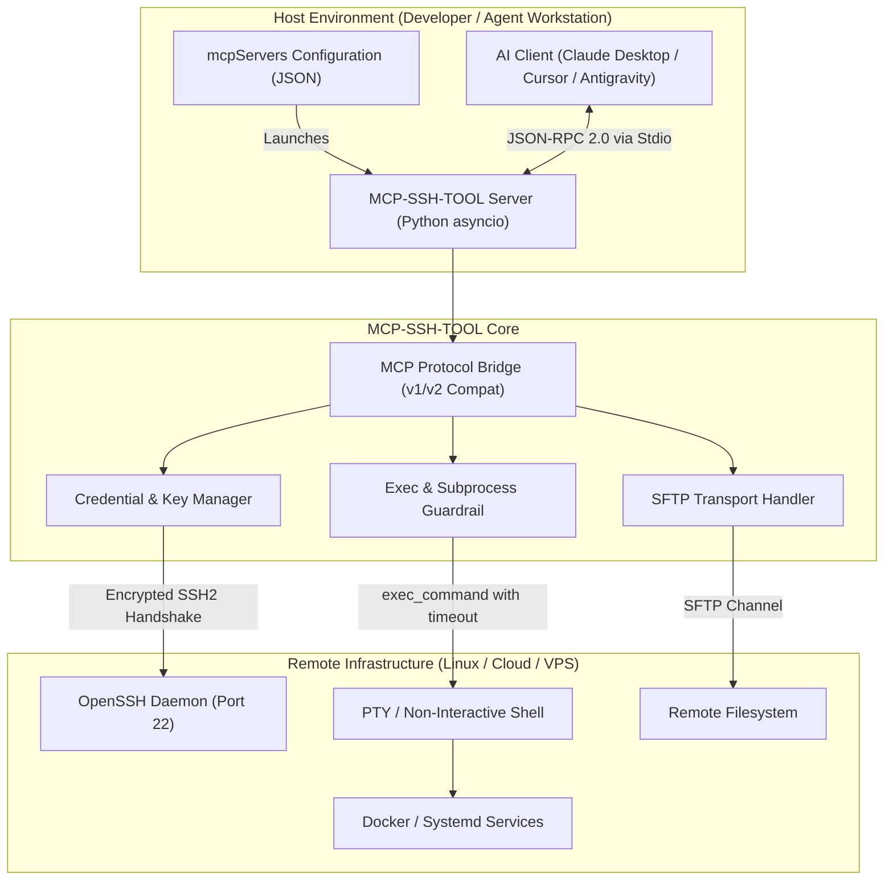

# MCP-SSH-TOOL — Model Context Protocol Remote Infrastructure Engine

<div align="center">

[](LICENSE)
[](https://www.python.org/downloads/)
[](https://modelcontextprotocol.io)
[](https://github.com/ManoAlee/MCP-SSH-TOOL/actions)
[](docs/SECURITY.md)

**Enterprise-grade Model Context Protocol (MCP) server for secure remote SSH infrastructure orchestration, command execution, and automated SFTP synchronization for Claude Desktop, Cursor, Antigravity, and AI Agents.**

[Key Features](#key-features) •
[Architecture](#architecture) •
[Installation](#installation) •
[Claude Desktop Config](#claude-desktop-configuration) •
[Tool Reference](#available-mcp-tools) •
[Security Guidelines](#security--audit)

</div>

---

## Overview

**MCP-SSH-TOOL** bridges large language models and autonomous AI agents with remote Linux/Unix/Windows infrastructure through Anthropic's **Model Context Protocol (MCP)**. Powered by `paramiko` and native asynchronous stdio transports, it provides a strictly controlled, sandboxed interface for agents to diagnose remote servers, inspect containers, tail logs, and execute administrative workflows without exposing raw host credentials or unverified shell access.

### Key Features

- 🔐 **Dual Authentication Modes:** Seamless authentication via environment variables (`SSH_HOST`, `SSH_USERNAME`, `SSH_PASSWORD`, `SSH_KEY_FILE`) or dynamic runtime connection parameters per session.
- ⚡ **Asynchronous Stdio Engine:** Built on `mcp` stdio server architecture with unified MCP 1.x & 2.x backward compatibility (`ListToolsRequest` and `CallToolRequest`).
- 📁 **Complete SFTP Pipeline:** Native support for remote directory listing, atomic uploads, and binary-safe file downloads with auto-handling of directory creation.
- 🛡️ **Execution Isolation & Timeouts:** Built-in execution timeout guardrails (default 60s) preventing hung processes from blocking agent trajectories.
- 🧪 **Deterministic Test Suite:** Complete unit and protocol integration tests mock-verified across Ubuntu and Windows CI matrix.

---

## Architecture


```mermaid
flowchart TD
    subgraph Host["Host Environment (Developer / Agent Workstation)"]
        Client["AI Client (Claude Desktop / Cursor / Antigravity)"]
        Config["mcpServers Configuration (JSON)"]
        Config -->|Launches| Server["MCP-SSH-TOOL Server (Python asyncio)"]
        Client <-->|JSON-RPC 2.0 via Stdio| Server
    end

    subgraph ServerCore["MCP-SSH-TOOL Core"]
        Bridge["MCP Protocol Bridge (v1/v2 Compat)"]
        Auth["Credential & Key Manager"]
        SFTP["SFTP Transport Handler"]
        Exec["Exec & Subprocess Guardrail"]
        Server --> Bridge
        Bridge --> Auth
        Bridge --> SFTP
        Bridge --> Exec
    end

    subgraph Remote["Remote Infrastructure (Linux / Cloud / VPS)"]
        SSHD["OpenSSH Daemon (Port 22)"]
        Shell["PTY / Non-Interactive Shell"]
        FS["Remote Filesystem"]
        Docker["Docker / Systemd Services"]
        
        Auth -->|Encrypted SSH2 Handshake| SSHD
        Exec -->|exec_command with timeout| Shell
        SFTP -->|SFTP Channel| FS
        Shell --> Docker
    end
```

---

## Installation

### Prerequisites

- Python 3.10 or higher
- OpenSSH client / target server with SSH accessibility

### Quick Install

```bash
# Clone the repository
git clone https://github.com/ManoAlee/MCP-SSH-TOOL.git
cd MCP-SSH-TOOL

# Set up a virtual environment
python -m venv .venv

# On Linux/macOS:
source .venv/bin/activate
# On Windows:
.venv\Scripts\activate

# Install dependencies
pip install -r server/requirements.txt
```

---

## Claude Desktop Configuration

Add the server to your `claude_desktop_config.json`:

### Option A: Static Environment Credentials (Automated Login)

```json
{
  "mcpServers": {
    "ssh": {
      "command": "python",
      "args": ["-m", "src.ssh_connect.server"],
      "cwd": "/path/to/MCP-SSH-TOOL/server",
      "env": {
        "SSH_HOST": "192.168.1.100",
        "SSH_PORT": "22",
        "SSH_USERNAME": "deployer",
        "SSH_KEY_FILE": "/home/user/.ssh/id_ed25519"
      }
    }
  }
}
```

### Option B: Dynamic Interactive Sessions

```json
{
  "mcpServers": {
    "ssh": {
      "command": "python",
      "args": ["-m", "src.ssh_connect.server"],
      "cwd": "/path/to/MCP-SSH-TOOL/server"
    }
  }
}
```
*The agent will invoke the `connect` tool dynamically during the conversation.*

---

## Available MCP Tools

| Tool | Parameters | Description |
| :--- | :--- | :--- |
| `connect` | `hostname`, `port`, `username`, `password`, `key_filename` | Initializes encrypted SSH session with remote target. |
| `disconnect` | *(none)* | Cleanly terminates active SSH session and releases SFTP transport handles. |
| `execute` | `command`, `timeout` *(default: 60s)* | Executes remote command via exec channel, returning stdout, stderr, and exit status. |
| `upload` | `local_path`, `remote_path` | Uploads local file to remote server via secure SFTP stream. |
| `download` | `remote_path`, `local_path` | Downloads remote file to local host via SFTP stream. |
| `list_files` | `path` *(default: ".")* | Lists directory entries with POSIX file permissions and metadata. |

---

## Running Tests

Verify protocol compliance and tool invocation:

```bash
cd server
python -m unittest discover -s tests -v
```

All 4 test cases (`test_import`, `test_list_tools`, `test_connect`, `test_execute`) run with mock SSH transports, requiring no live network connection.

---

## Security & Audit

- **Principle of Least Privilege:** Always authenticate with service users restricted to specific `sudoers` commands rather than raw `root`.
- **Key Authentication:** RSA-4096 or Ed25519 public key authentication is strongly advised over password-based auth.
- **Untrusted Output Boundary:** Outputs received from remote servers must be treated as untrusted data in agent evaluation loops to prevent prompt injection.

---

## Contributing

Contributions, bug reports, and PRs are welcome! Please ensure:
1. All changes maintain MCP 1.x & 2.x compatibility.
2. New tools include corresponding mock tests in `server/tests/`.
3. Adhere to PEP 8 styling conventions.

---

## License

This project is licensed under the MIT License - see the [LICENSE](LICENSE) file for details.
