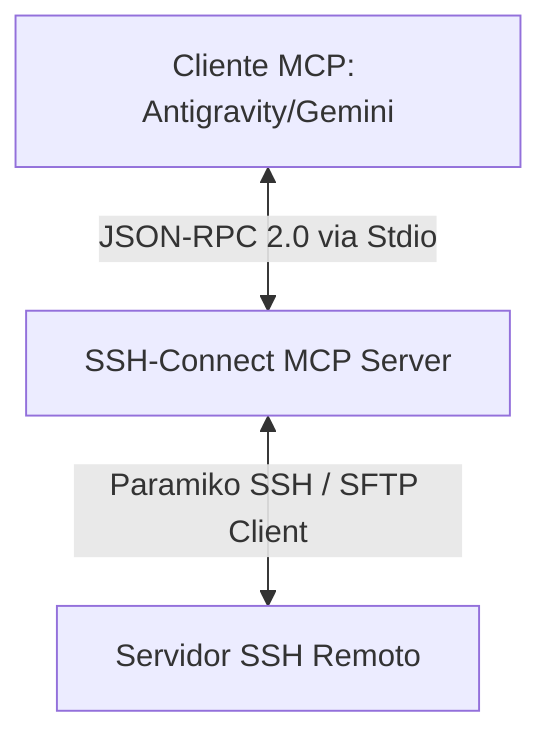

# Arquitetura do Sistema - SSH-Connect MCP Server

Este documento detalha o design arquitetural, o modelo de segurança e a topologia de diretórios de nível corporativo do **SSH-Connect MCP Server**.

---

## 1. Visão Geral do MCP (Model Context Protocol)

O **Model Context Protocol (MCP)** é um padrão aberto que especifica como assistentes de inteligência artificial (como o Gemini/Antigravity) podem consumir ferramentas (tools) e recursos expostos por servidores externos.

A comunicação neste projeto ocorre estritamente via **Stdio (Standard Input / Standard Output)** utilizando o protocolo **JSON-RPC 2.0**.



### Fluxo de Ciclo de Vida JSON-RPC
1. **Handshake de Inicialização**: O cliente inicia o processo do servidor e envia um JSON-RPC com o método `initialize`. O servidor responde com suas capacidades (`capabilities`) e a lista de ferramentas disponíveis.
2. **Listagem de Ferramentas**: O cliente obtém os schemas JSON das ferramentas (`list_tools`).
3. **Chamada de Ferramentas**: Quando o assistente de IA necessita executar uma ação SSH (como conectar, listar arquivos ou rodar comandos), ele envia um JSON-RPC `call_tool`. O servidor executa de forma assíncrona usando a biblioteca `paramiko` e retorna o resultado formatado em texto.
4. **Encerramento**: No encerramento do assistente de IA, o stream `stdin` é fechado e o servidor se desliga de maneira graciosa.

---

## 2. Estrutura de Diretórios Enterprise

Para atender às práticas recomendadas de engenharia de software (padrão de maturidade sênior), o projeto foi estruturado para segregar responsabilidades, isolar segredos e manter os scripts de ciclo de vida organizados.

```
C:\ssh-mcp\
├── .env                          # Segredos locais e credenciais SSH (NUNCA comitar)
├── .env.example                  # Template de configuração pública
├── .gitignore                    # Regras de exclusão globais do Git
├── README.md                     # Portal de entrada e Quick Start do projeto
│
├── config/                       # Arquivos de configuração do servidor e clientes
│   └── mcp_config.json           # Definição do MCP para registro local no Gemini/Antigravity
│
├── docs/                         # Documentação técnica e relatórios
│   ├── ARCHITECTURE.md           # [Este arquivo] Detalhamento arquitetural
│   ├── RUNBOOK.md                # Manual de operações, manutenção e troubleshooting
│   └── ...                       # Documentos complementares
│
├── logs/                         # Registros de atividades em produção (Rotacionável)
│   └── ssh-mcp.log               # Arquivo ativo de logs do servidor
│
├── scripts/                      # Utilitários de automação e ciclo de vida
│   ├── quick-check.ps1           # Diagnóstico automatizado de saúde do sistema (20 testes)
│   ├── setup.ps1                 # Provisionamento de dependências e ambiente (.venv)
│   ├── Register-StartupTask.ps1  # Script para registro do serviço no Windows Startup
│   └── StartSSHMCP.bat           # Wrapper batch para execução silenciosa em background
│
├── server/                       # Código-fonte principal do Servidor Python (MCP)
│   ├── src/ssh_connect/          # Pacote Python nativo
│   │   ├── __init__.py           # Ponto de entrada do script e export do main()
│   │   └── server.py             # Lógica central do servidor, handlers e logging
│   ├── pyproject.toml            # Dependências gerenciadas via Hatchling/UV
│   └── uv.lock                   # Lockfile determinístico do UV
│
└── tests/                        # Suite de testes integrados e unitários
    ├── test_connection.py        # Teste de conectividade pura SSH (Paramiko)
    ├── test_mcp_direct.py        # Teste direto dos handlers de métodos Python do MCP
    └── test_mcp_protocol.py      # Teste de ponta a ponta do handshake JSON-RPC via subprocesso
```

---

## 3. Modelo de Segurança e Isolamento de Segredos

O design do projeto garante total conformidade com as melhores práticas corporativas de segurança (OWASP / GDPR):

* **Decoupling de Credenciais**: Nenhuma chave privada ou credencial SSH (senha, host, usuário) é armazenada de forma hardcoded nos arquivos de configuração do cliente (`mcp_config.json`) ou no código-fonte.
* **Carregamento Automatizado de Variáveis**: O arquivo `.env` no diretório raiz do projeto armazena os segredos locais. O servidor de produção do Python localiza o arquivo `.env` em tempo de execução e importa as credenciais dinamicamente para o ambiente de execução (`os.environ`).
* **Segurança do Repositório**: O arquivo `.gitignore` protege os segredos, logs e dependências locais de serem comitados acidentalmente no controle de versão (Git).

---

## 4. Gerenciamento de Logs e Auditoria

Toda transação realizada pelo assistente de IA é documentada no arquivo central `logs/ssh-mcp.log`:
* **Conexões e Desconexões**: Registro de data, hora, usuário e host remoto.
* **Comandos Executados**: Os comandos remotos invocados pelas ferramentas são registrados em logs para auditoria de segurança.
* **Erros e Stack Traces**: Qualquer falha na comunicação SSH ou na rede é registrada com seu respectivo stack trace técnico para facilitar diagnósticos sem expor dados confidenciais na saída padrão (`stdout`) do MCP.
